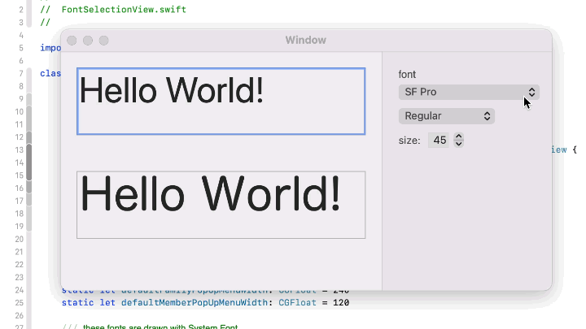

# FontSelectionView


View is for selecting fonts instead of NSFontPanel



## How to Use

Just copy *FontSelctionView.swift* and *FontSelectionView.xib* into your project.

example:
```Swift
    let fontView = FontSelectionView.instantiate()

    override func viewDidLoad() {
        super.viewDidLoad()

        view.addSubview(fontView)

        // select fonts
        fontView.select(fonts: [NSFont(name: "SF Pro", size: NSFont.systemFontSize)!])

        // set callback
        fontView.onSelectHandler = { fonts in
            print("newFonts=\(fonts)")
        }
    }

```

## License

MIT
